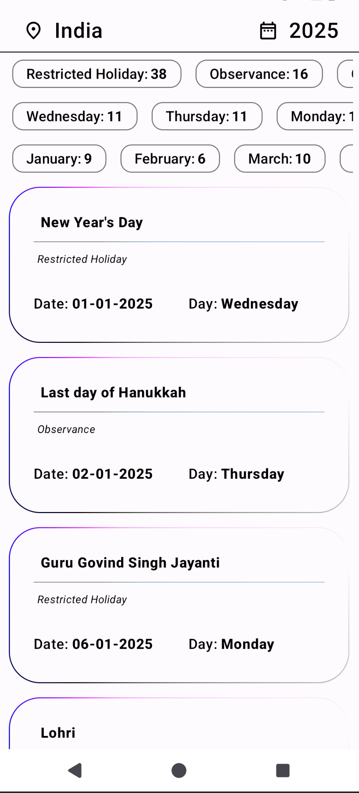

# Holiday Finder

## This App list all of the Holiday for selected year & country
  - It also consist of Filter mechanism to filter based on Holiday type

## Planned updates
  - Adding more Filter options based on
    - Days
    - Month
    - Themes(Dark and White nothing Fancy)

## Tech used
  - Kotlin
  - Jetpack compose framework
  - Holiday API by [**11Holidays API**](https://11holidays.com) ***Note:*** This api is completely free with no authentication key on date(Apr 7, 2025) of publishing this project v1

## Features
 - 194 countries
 - 20 years range From 2020 to 2040 ***Note:*** Api return empty for some countries&year combo. Example Country: India, year: 2020 will be blank screen

## Output Screenshot
### Home page

